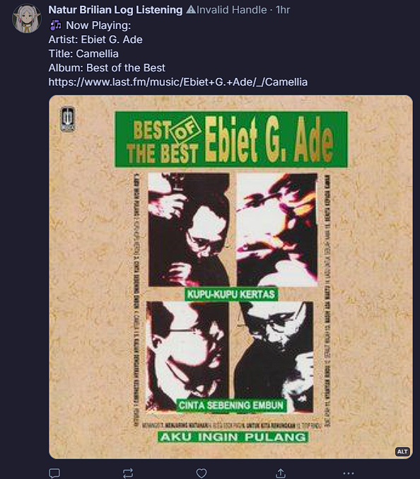
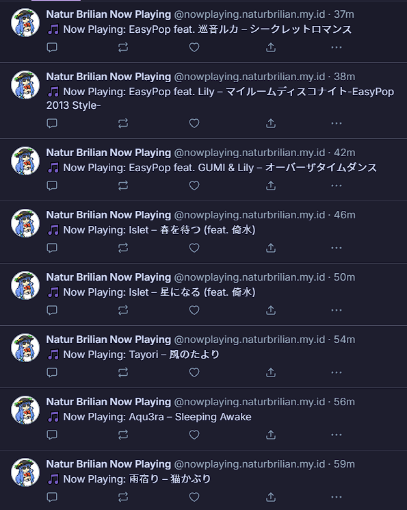

# About
This python script is created with the help of chatGPT with some modifications.

This script allows you to update your listening status from last fm to bluesky. An example can be found at [@scrobble.naturbrilian.dpdns.org‬](https://bsky.app/profile/scrobble.naturbrilian.dpdns.org).

## Preview

1. With Album Art

2. No Album Art

# How to Get your App Password (Bluesky)

1. Open settings on bsky
2. Go to Privacy & Security
3. And select Apps Password

# For lastfm

1. Create your api from [here](https://www.last.fm/api/account/create)
2. Then copy your apikey

> [!Note]
> Since these are just a few edits to work perfectly, you are free to modify them.

## Blog article
https://naturbrilian.great-site.net/lastfm-autopost-to-bluesky/
